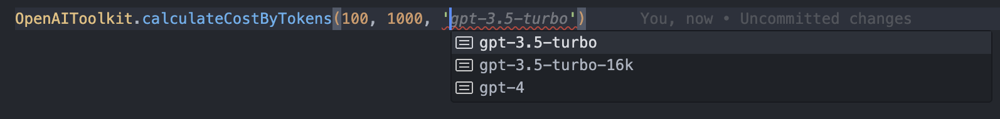

## @pezzo/llm-toolkit

LLM Toolkit is a collection of llm providers and utilities.

### Installation

```bash
npm install @pezzo/llm-toolkit
```

### Usage

```javascript
import { OpenAIToolkit } from "@pezzo/llm-toolkit";
```

### Get model pricing

```javascript
const { promptCostPer1000Tokens, completionCostPer1000Tokens } =
  OpenAIToolkit.models["gpt-3.5-turbo"];
```

### Calculate cost of a prompt

```javascript
// the modelName parameter is fully typed, you'll be able to see a a list with the available models

const cost = OpenAIToolkit.calculateCostByTokens(
  promptTokens,
  completionTokens,
  modelName
);
```

_Note: The model name parameter is fully typed, you'll be able to see a list with the available models._


### Available Providers

- [OpenAI](https://beta.openai.com/)
